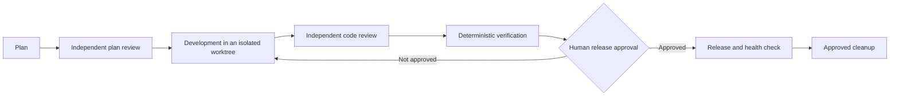

# Agent Ship Flow

English | [简体中文](README.zh-CN.md)

[](https://github.com/Aidenwu0209/agent-ship-flow/actions/workflows/ci.yml)
[](pyproject.toml)
[](LICENSE)
[](pyproject.toml)

> Durable, reviewable Git shipping workflows for AI agents.

## Why Agent Ship Flow

Agent Ship Flow makes a delivery workflow recoverable instead of relying on an
agent's chat history. Its standard-library `ship` CLI stores the workflow state,
evidence, approvals, and operation receipts in the repository. Compatible
agents can use the same JSON contract, while the included Codex adapter offers
one ready-made controller.

The engine is intentionally agent-neutral: it needs Python 3.11+, Git, and an
existing Git repository, but no external runtime dependency or model API.

## How the flow stays safe



- The engine binds review and verification evidence to the current Git and
  manifest state; changed inputs make stale evidence unusable.
- External operations retain durable receipts. An `UNKNOWN` result is probed or
  sent to a human decision; it is never blindly replayed.
- Push, merge, release, deploy, data-impacting rollback, and cleanup remain
  explicit, current-state actions. The flow does not automatically commit your
  repository policy.

## Start in the path that fits you

- **Ship a repository with any compatible agent:** follow the [CLI quick
  start](docs/quickstart.md).
- **Integrate an agent with the JSON protocol:** read the [agent integration
  guide](docs/agent-integration.md).
- **Install the Codex adapter:** use the [Codex adapter quick
  start](docs/ship-flow-quickstart.md).

For a new repository, run `ship init --repo <absolute-repo-path> --json`, show
the detected policy, and use `--accept-detected` only after the human confirms
it. A newly accepted manifest returns the human `commit_manifest` action. The
user must review `.ship/manifest.toml`, add it, and commit it before `ship
start`; `ship start` requires a clean base when that policy is enabled.

For an existing run, every later agent turn begins with:

```bash
ship status --repo <absolute-repo-path> --run-id <run-id> --json
```

Read the returned state, evidence status, and complete `next_action`; do not
reconstruct the workflow from chat history or Git status alone.

## Documentation

See the [documentation index](docs/README.md) for English and Chinese entry
points, the [workflow protocol](docs/agent-integration.md) for adapter authors,
and the [Codex adapter guide](docs/ship-flow-quickstart.md) for installation,
recovery, release, rollback, and uninstall.

## Develop and verify

```bash
python3 -m pip install -e ".[dev]"
python3 -m unittest discover -s tests/unit -v
python3 -m unittest discover -s tests/integration -v
ruff format --check src/ship_flow tests scripts/install_codex_skill.py scripts/install-codex-skill.py
ruff check src/ship_flow tests scripts/install_codex_skill.py scripts/install-codex-skill.py
git diff --check
```

GitHub Actions runs the supported test matrix on Python 3.11 and 3.12.

## Contributing, security, and license

Read [CONTRIBUTING.md](CONTRIBUTING.md) before contributing and
[SECURITY.md](SECURITY.md) before reporting a vulnerability. Agent Ship Flow is
available under the [MIT License](LICENSE).
