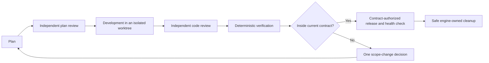

# Agent Ship Flow

English | [简体中文](README.zh-CN.md)

[](https://github.com/Aidenwu0209/agent-ship-flow/actions/workflows/ci.yml)
[](pyproject.toml)
[](LICENSE)
[](pyproject.toml)

> Durable, reviewable Git shipping workflows for AI agents.

## Why Agent Ship Flow

Agent Ship Flow makes delivery recoverable instead of relying on chat history.
Its standard-library `ship` CLI stores workflow state, authorization contracts,
evidence, approvals, and operation receipts in the repository. Compatible
agents use the same JSON contract; the included Codex adapter is one controller.

The engine needs Python 3.11+, Git, and an existing Git repository, but no
external runtime dependency or model API.

| Guarantee | What it means |
| --- | --- |
| Scope-authorized autonomy | New runs default to `autonomous`. The initial goal and current contract authorize every in-contract automatic action; the only ordinary human question is `approve_scope_change`. |
| Strict compatibility | `--mode strict` preserves plan, release, rollback, and cleanup approvals. A legacy run with no contract also behaves as strict. |
| Independent roles | Planner, Plan Critic, Developer, Reviewer, and Verifier remain independent in both modes. |
| Evidence freshness | Review, Verification, release, health, rollback, and cleanup evidence remains subject-bound; changed inputs make it unusable. |
| Unknown-outcome recovery | An external `UNKNOWN` result is a manual safety block and is never blindly replayed. |

## How the flow stays safe



Autonomous mode removes conversational approval stops, not evidence. Contract
gate receipts use `scope-contract:<contract-digest>`. Automatic cleanup still
refuses dirty, foreign, unsafe, or otherwise ineligible worktrees. A manual
`UNKNOWN` state preserves the immutable receipt and waits for a conclusive probe
or adjudication; it is not treated as permission to retry.

## Start with autonomous mode

Detect and version the manifest, then start the run. `autonomous` is the default:

```bash
ship init --repo /absolute/path/to/repo --json
git add .ship/manifest.toml
git commit -m "chore: configure ship flow"
ship start \
  --repo /absolute/path/to/repo \
  --run-id run-login-error-001 \
  --goal "Show an actionable error when login fails" \
  --release-target production \
  --previous-release v1 \
  --json
```

`init` returns automatic `commit_manifest` in autonomous mode. A controller
executes that action without asking; the Git commands above show the same
required commit boundary for a person using the CLI directly.

The run contract binds mode, repository, owned worktree, exact goal, branch,
manifest digest (verification/release/health/rollback material), release target,
previous release, generation, creation time, and state revision. Status exposes:

```json
{"authorization":{"mode":"autonomous","source":"contract","generation":1,"digest":"<sha256>"}}
```

Every later turn begins with durable status:

```bash
ship status --repo /absolute/path/to/repo --run-id run-login-error-001 --json
```

Execute every returned automatic action. Ask only when an autonomous run returns
`approve_scope_change`; report progress and manual safety blocks as statements.

## Scope change and strict mode

If the original goal covered account export and the user adds a deployment
dashboard, record the proposed boundary before doing dashboard work:

```bash
ship request-scope-change --repo /absolute/path/to/repo --run-id run-login-error-001 --expected-revision 12 --reason feature_expansion --summary "add deployment dashboard" --goal "ship account export and a deployment dashboard" --manifest-sha256 <sha256> --release-target production --json
ship resolve-scope-change --repo /absolute/path/to/repo --run-id run-login-error-001 --expected-revision 13 --decision approve --actor human-owner --json
```

Approval creates a new contract generation and returns to planning, so evidence
for the old boundary is not reused. For explicit audit gates, start with one
strict option:

```bash
ship start --repo /absolute/path/to/repo --run-id run-audit-001 --goal "Ship the audited change" --mode strict --json
```

## Documentation

- [CLI quick start](docs/quickstart.md)
- [Agent integration contract](docs/agent-integration.md)
- [Codex adapter quick start](docs/ship-flow-quickstart.md)
- [Documentation index](docs/README.md)

## Develop and verify

```bash
python3 -m pip install -e ".[dev]"
python3 -m unittest discover -s tests/unit -v
python3 -m unittest discover -s tests/integration -v
ruff format --check src/ship_flow tests scripts/install_codex_skill.py scripts/install-codex-skill.py
ruff check src/ship_flow tests scripts/install_codex_skill.py scripts/install-codex-skill.py
ship --help
git diff --check
```

GitHub Actions runs lint once on Python 3.12, then the supported test matrix on
Python 3.11 and 3.12.

## Contributing, security, and license

Read [CONTRIBUTING.md](CONTRIBUTING.md) before contributing and
[SECURITY.md](SECURITY.md) before reporting a vulnerability. Agent Ship Flow is
available under the [MIT License](LICENSE).
