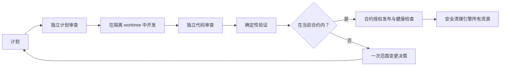

# Agent Ship Flow

[English](README.md) | 简体中文

[](https://github.com/Aidenwu0209/agent-ship-flow/actions/workflows/ci.yml)
[](pyproject.toml)
[](LICENSE)
[](pyproject.toml)

> 面向 AI Agent 的可恢复、可审查 Git 交付流程。

## 为什么使用 Agent Ship Flow

Agent Ship Flow 将交付保存为可恢复状态，而不是依赖聊天记录。标准库
`ship` CLI 会在仓库中保存流程状态、授权合约、证据、批准和操作回执。
任何兼容 Agent 都可使用同一套 JSON 合约；仓库也提供 Codex 控制层。

引擎需要 Python 3.11+、Git 和一个已存在的 Git 仓库，但不需要外部运行时依赖或模型 API。

| 保障 | 含义 |
| --- | --- |
| 范围授权自主执行 | 新运行默认为 `autonomous`。初始目标和当前合约授权所有范围内自动操作；唯一常规人工问题是 `approve_scope_change`。 |
| 严格模式兼容 | `--mode strict` 保留计划、发布、回滚和清理批准。没有合约的旧运行也按 strict 执行。 |
| 独立职责 | Planner、Plan Critic、Developer、Reviewer 和 Verifier 在两种模式下都保持独立。 |
| 证据时效性 | Review、Verification、发布、健康检查、回滚和清理证据继续绑定当前 subject；输入变化会使它们失效。 |
| 未知结果恢复 | 外部操作结果为 `UNKNOWN` 时是手动安全阻塞，不会被盲目重放。 |

## 流程如何保持安全



`autonomous` 去掉的是对话式批准停顿，不是证据。合约关卡回执使用
`scope-contract:<contract-digest>`。自动清理仍会拒绝脏、外来、不安全或不满足
条件的 worktree。手动 `UNKNOWN` 状态会保留不可变回执，等待可靠 probe 或裁定，
不会被当成重试许可。

## 从自主模式开始

先检测并版本化 manifest，再启动运行。`autonomous` 是默认值：

```bash
ship init --repo /absolute/path/to/repo --json
git add .ship/manifest.toml
git commit -m "chore: configure ship flow"
ship start \
  --repo /absolute/path/to/repo \
  --run-id run-login-error-001 \
  --goal "登录失败时显示可操作的错误提示" \
  --release-target production \
  --previous-release v1 \
  --json
```

在 autonomous 模式下，`init` 返回自动 `commit_manifest`。控制层不询问就执行该操作；
上面的 Git 命令是人工直接使用 CLI 时需跨越的同一提交边界。

运行合约绑定模式、仓库、引擎所有 worktree、精确目标、分支、manifest 摘要
（包含验证/发布/健康检查/回滚材料）、发布目标、上一版本、generation、创建时间和状态 revision。
状态会公开：

```json
{"authorization":{"mode":"autonomous","source":"contract","generation":1,"digest":"<sha256>"}}
```

每一轮后续对话都从持久状态开始：

```bash
ship status --repo /absolute/path/to/repo --run-id run-login-error-001 --json
```

执行每个返回的自动操作。autonomous 运行只在返回 `approve_scope_change` 时询问；
进度和手动安全阻塞都用陈述句报告。

## 范围变更与严格模式

如果原目标仅包含账户导出，用户又要求部署仪表盘，必须在开始仪表盘工作前记录新边界：

```bash
ship request-scope-change --repo /absolute/path/to/repo --run-id run-login-error-001 --expected-revision 12 --reason feature_expansion --summary "add deployment dashboard" --goal "ship account export and a deployment dashboard" --manifest-sha256 <sha256> --release-target production --json
ship resolve-scope-change --repo /absolute/path/to/repo --run-id run-login-error-001 --expected-revision 13 --decision approve --actor human-owner --json
```

批准会创建新的合约 generation 并返回计划阶段，不会复用旧边界的证据。需要显式审计
关卡时，使用一个 strict 选项：

```bash
ship start --repo /absolute/path/to/repo --run-id run-audit-001 --goal "交付需审计的变更" --mode strict --json
```

## 文档导航

- [CLI 快速入门](docs/quickstart-zh.md)
- [Agent 集成合约](docs/agent-integration.md)
- [Codex 适配器快速入门](docs/ship-flow-quickstart-zh.md)
- [文档索引](docs/README.zh-CN.md)

## 开发与验证

```bash
python3 -m pip install -e ".[dev]"
python3 -m unittest discover -s tests/unit -v
python3 -m unittest discover -s tests/integration -v
ruff format --check src/ship_flow tests scripts/install_codex_skill.py scripts/install-codex-skill.py
ruff check src/ship_flow tests scripts/install_codex_skill.py scripts/install-codex-skill.py
ship --help
git diff --check
```

GitHub Actions 会在 Python 3.12 上运行 lint，然后在 Python 3.11 和 3.12 上运行测试矩阵。

## 贡献、安全与许可证

贡献前请阅读 [CONTRIBUTING.md](CONTRIBUTING.md)，发现漏洞请阅读
[SECURITY.md](SECURITY.md)。Agent Ship Flow 使用 [MIT License](LICENSE)。
