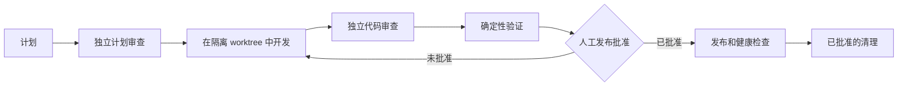

# Agent Ship Flow

[English](README.md) | 简体中文

[](https://github.com/Aidenwu0209/agent-ship-flow/actions/workflows/ci.yml)
[](pyproject.toml)
[](LICENSE)
[](pyproject.toml)

> 面向 AI Agent 的可恢复、可审查 Git 交付流程。

## 为什么使用 Agent Ship Flow

Agent Ship Flow 将交付流程保存为可恢复的状态，而不是依赖 Agent 的聊天记录。
标准库 `ship` CLI 会在仓库中保存流程状态、证据、批准和操作回执。任何兼容 Agent
都可以使用同一套 JSON 协议；仓库也提供了可选的 Codex 适配器。

核心保持 Agent 无关：它需要 Python 3.11+、Git 和一个已有的 Git 仓库，但不需要
外部运行时依赖或模型 API。

| 保障 | 含义 |
| --- | --- |
| 隔离 worktree | 开发在隔离的 worktree 中进行。 |
| 独立职责 | Planner、Plan Critic、Developer、Reviewer 和 Verifier 保持相互独立。 |
| 证据时效性 | Review 和 Verification 证据绑定到当前 Git 与 manifest 状态；输入变化会使它们失效。 |
| 未知结果恢复 | 外部操作结果为 `UNKNOWN` 时，系统会 probe 或转为人工裁定，不会盲目重放。 |
| 人工关卡 | push、merge、release、deploy、可能影响数据的 rollback 和 cleanup 始终需要明确的人工决策。 |

## 流程如何保持安全



- 引擎将 Review 和 Verification 证据绑定到当前 Git 与 manifest 状态；输入变化会使
  旧证据失效。
- 外部操作保留可恢复的回执。结果为 `UNKNOWN` 时，系统会 probe 或转为人工裁定，
  不会盲目重放操作。
- push、merge、release、deploy、可能影响数据的 rollback 和 cleanup 都是基于当前
  状态的明确操作；流程不会自动提交你的项目策略。

## 选择你的开始方式

- **使用任意兼容 Agent 交付仓库：**阅读 [CLI 快速入门](docs/quickstart-zh.md)。
- **使用 JSON 协议集成 Agent：**阅读 [Agent 集成说明](docs/agent-integration.md)。
- **安装 Codex 适配器：**阅读 [Codex 适配器快速入门](docs/ship-flow-quickstart-zh.md)。

新仓库先运行 `ship init --repo <absolute-repo-path> --json`，展示检测到的策略，并且
只在用户确认后使用 `--accept-detected`。新确认的 manifest 会返回人工 JSON 操作
`commit_manifest`。用户必须审阅、暂存并提交 `.ship/manifest.toml`，然后才能执行
`ship start`；当策略启用时，`ship start` 需要干净的基础工作树。

已有运行的每一轮 Agent 对话都从以下命令开始：

```bash
ship status --repo <absolute-repo-path> --run-id <run-id> --json
```

以返回的状态、证据状态和完整 `next_action` 为准，不要用聊天记录或 Git 状态推断流程。

## 文档导航

请从[文档索引](docs/README.zh-CN.md)进入中英文指南；适配器作者请阅读
[流程协议](docs/agent-integration.md)，Codex 用户请阅读
[Codex 适配器指南](docs/ship-flow-quickstart-zh.md)。

## 开发与验证

```bash
python3 -m pip install -e ".[dev]"
python3 -m unittest discover -s tests/unit -v
python3 -m unittest discover -s tests/integration -v
ruff format --check src/ship_flow tests scripts/install_codex_skill.py scripts/install-codex-skill.py
ruff check src/ship_flow tests scripts/install_codex_skill.py scripts/install-codex-skill.py
ship --help
git diff --check
```

GitHub Actions 会在 Python 3.12 上各运行一次 Ruff 格式检查和 lint 检查；unit、
integration 与 `ship --help` smoke 检查会在 Python 3.11 和 3.12 上运行。

## 贡献、安全与许可证

贡献前请阅读 [CONTRIBUTING.md](CONTRIBUTING.md)，发现漏洞请阅读
[SECURITY.md](SECURITY.md)。Agent Ship Flow 使用 [MIT License](LICENSE)。
